# surface-catalysis-gaia

> **Original work:** Mason, S. E., Grinberg, I., & Rappe, A. M. "[First-principles extrapolation method for accurate CO adsorption energies on metal surfaces.](https://doi.org/10.48550/arXiv.cond-mat/0310688)" arXiv:cond-mat/0310688 (2003). Extended with systematic contradiction analysis from multiple sources.

> [!NOTE]
> This README is an AI-generated analysis based on a [Gaia](https://github.com/SiliconEinstein/Gaia) reasoning graph that formalizes the Mason et al. (2003) correction method and its subsequent validations and challenges. Belief values reflect the graph's probabilistic assessment of each claim's support, not the original authors' confidence. See the [per-module reasoning graphs](docs/detailed-reasoning.md) for full claim details.

## Overview

> [!TIP]
> **Reasoning graph information gain: `1.4 bits`**
>
> Total mutual information between leaf premises and exported conclusions — measures how much the reasoning structure reduces uncertainty about the results.

```mermaid
---
config:
  flowchart:
    rankSpacing: 80
    nodeSpacing: 30
---
graph TB
    prem_benchmark_valid["prem_benchmark_valid\n(0.75 → 0.68)"]:::premise
    prem_extrapolation_valid["prem_extrapolation_valid\n(0.70 → 0.20)"]:::premise
    root_correction_method["★ root_correction_method\n(0.50 → 0.05)"]:::exported
    gga_2pi_too_low["★ gga_2pi_too_low\n(0.88 → 0.95)"]:::exported
    co_2pi_mechanism["co_2pi_mechanism\n(0.82 → 0.89)"]:::premise
    hybrid_magnitude_nonuniform["hybrid_magnitude_nonuniform\n(0.82 → 0.85)"]:::premise
    hybrid_direction_inconsistent["★ hybrid_direction_inconsistent\n(0.78 → 0.82)"]:::exported
    hybrid_limitation["★ hybrid_limitation\n(0.80 → 0.89)"]:::exported
    correction_reduces_site_spread["correction_reduces_site_spread\n(0.65 → 0.44)"]:::premise
    vdw_effect_co["★ vdw_effect_co\n(0.82 → 0.89)"]:::exported
    vdw_geometry_issues["vdw_geometry_issues\n(0.70 → 0.75)"]:::premise
    mason_validation_pt_al2o3["mason_validation_pt_al2o3\n(0.65 → 0.38)"]:::premise
    method_cross_comparison["method_cross_comparison\n(0.72 → 0.81)"]:::premise
    contradiction_hybrid["contradiction_hybrid\n(0.88 → 1.00)"]:::premise
    contradiction_site_ordering["contradiction_site_ordering\n(0.82 → 1.00)"]:::premise
    correction_site_reordering["correction_site_reordering\n(0.78 → 0.59)"]:::premise
    contradiction_vdw_gap["contradiction_vdw_gap\n(0.90 → 1.00)"]:::premise
    experimental_site_methods["★ experimental_site_methods\n(0.78 → 0.33)"]:::exported
    contradiction_experiment_ambiguity["contradiction_experiment_ambiguity\n(0.75 → 1.00)"]:::premise
    strat_0(["infer\n0.28 bits"]):::weak
    co_2pi_mechanism --> strat_0
    correction_reduces_site_spread --> strat_0
    gga_2pi_too_low --> strat_0
    mason_validation_pt_al2o3 --> strat_0
    method_cross_comparison --> strat_0
    prem_benchmark_valid --> strat_0
    prem_extrapolation_valid --> strat_0
    strat_0 --> root_correction_method
    strat_1(["infer\n0.56 bits"]):::weak
    hybrid_direction_inconsistent --> strat_1
    hybrid_magnitude_nonuniform --> strat_1
    strat_1 --> hybrid_limitation
    strat_2(["infer\n0.57 bits"]):::weak
    vdw_geometry_issues --> strat_2
    strat_2 --> vdw_effect_co
    oper_0{{"⊗"}}:::contra
    root_correction_method --- oper_0
    hybrid_limitation --- oper_0
    oper_0 --- contradiction_hybrid
    oper_1{{"⊗"}}:::contra
    prem_extrapolation_valid --- oper_1
    correction_site_reordering --- oper_1
    oper_1 --- contradiction_site_ordering
    oper_2{{"⊗"}}:::contra
    root_correction_method --- oper_2
    vdw_effect_co --- oper_2
    oper_2 --- contradiction_vdw_gap
    oper_3{{"⊗"}}:::contra
    correction_site_reordering --- oper_3
    experimental_site_methods --- oper_3
    oper_3 --- contradiction_experiment_ambiguity

    classDef premise fill:#ddeeff,stroke:#4488bb,color:#333
    classDef exported fill:#d4edda,stroke:#28a745,stroke-width:2px,color:#333
    classDef weak fill:#fff9c4,stroke:#f9a825,stroke-dasharray: 5 5,color:#333
    classDef contra fill:#ffebee,stroke:#c62828,color:#333
```

> [!NOTE]
> **[Per-module reasoning graphs with full claim details →](docs/detailed-reasoning.md)**
>
> 5 Mermaid diagrams (one per module) with every claim, strategy, and belief value.

## Summary

Accurate first-principles prediction of chemisorption energies is a central goal of computational surface catalysis, yet standard density functional theory (DFT) with generalized gradient approximation (GGA) functionals systematically overestimates CO binding on transition metals. Mason, Grinberg, and Rappe (2003) proposed a correction method that extrapolates DFT-GGA chemisorption energies to a high-level wavefunction benchmark using the gas-phase CO singlet-triplet excitation energy (ΔE_ST = 6.095 eV from CC/CI calculations) as a linear scaling parameter. This package formalizes their method along with subsequent validations, contradictions, and methodological limitations discovered through systematic literature search. The graph reveals a striking tension: the physical mechanism of GGA failure — self-interaction error placing the CO 2π* orbital too low — is extremely well-established (belief 0.95), but the proposed universal correction method is almost certainly not valid as stated (belief 0.05). Three independent lines of contradiction — metal-dependent hybrid functional behavior, unaccounted van der Waals contributions of ~116 meV, and site-reordering uncertainty — converge to undermine the method's claim of providing a general first-principles benchmark.

## Reasoning Structure

### Why GGA fails for CO chemisorption: the 2π* orbital error (belief: 0.95)

The most robust finding in this graph is the physical origin of GGA's systematic overbinding of CO on transition metals. The GGA self-interaction error causes the unoccupied CO 2π* orbital to be placed too low in energy relative to the substrate Fermi level. This is not a minor quantitative correction — it fundamentally distorts the Blyholder bonding picture. In the correct physical description, CO binds to metals via σ-donation (CO 5σ → metal d) and π back-donation (metal d → CO 2π*). By artificially lowering the 2π* acceptor orbital, GGA spuriously enhances the back-donation channel, overestimating the chemisorption strength at sites where back-donation dominates (on-top and bridge sites on late transition metals).

**Evidence support:**
- **GGA 2π* energy misplacement** (belief 0.95): The 2π* orbital energy error is directly observable by comparing GGA Kohn-Sham eigenvalues with GW quasiparticle energies or hybrid functional orbital energies. The effect is robust across Pt, Rh, Pd, Cu, and Ru surfaces.
- **Causal chain to back-donation** (belief 0.99): The link from 2π* too low → overestimated back-donation is supported by the well-established Blyholder model and charge-decomposition analysis. However, the quantitative contribution of back-donation relative to σ-donation varies by metal and site — the back-donation dominance is strongest for late transition metals with filled d-bands close to the Fermi level.

> This mechanism is the strong foundation on which the correction method is built. The graph assigns it very high belief because it is confirmed by multiple independent electronic-structure methods and is physically intuitive within the standard chemisorption model.

### The Mason correction method: linear extrapolation via singlet-triplet splitting (belief: 0.05)

Mason et al. observed that the DFT-GGA error in the gas-phase CO singlet-triplet excitation energy (ΔE_ST, the 5σ → 2π* promotion energy) correlates linearly with the error in the surface chemisorption energy. Their correction shifts the computed chemisorption energy along the site-specific linear relation E_chem^GGA = E_0 + m × ΔE_ST^GGA to the CC/CI benchmark target ΔE_ST^CI = 6.095 eV, yielding E_chem^corr = E_chem^GGA + (ΔE_ST^CI − ΔE_ST^GGA) × m. The method was parameterized on Pt, Rh, Pd, and Cu (111) and (100) surfaces using the PW91 GGA functional.

The correction rests on three premises:
1. **Linear mapping** (belief 0.98): E_chem^GGA and ΔE_ST^GGA are linearly related, and the gas-phase electronic-structure error maps linearly onto the surface bonding error. This is well-supported by multi-method validation across PBE, HSE06, PBE0, HF, and CR-CC(2,3) on Pd systems.
2. **Benchmark validity** (belief 0.68): The gas-phase CC/CI benchmark ΔE_ST^CI = 6.095 eV remains the appropriate target in the chemisorbed geometry — i.e., metal-induced polarization, image-charge stabilization, and substrate screening do not substantially shift the required reference energy. This is the moderate-strength premise: while the CC/CI benchmark is accurate for gas-phase CO, the assumption that surface environmental effects are negligible has not been systematically validated.
3. **Extrapolation validity** (belief 0.20): The linear fit from the GGA-sampled interval [5.35, 5.84] eV remains valid when extrapolated to the CI target at 6.095 eV. **This is the critical weak link.** Three lines of evidence converge against it:
   - Hybrid functionals (PBE0, HSE03) that partially correct the 2π* energy do NOT produce a uniform improvement — the correction magnitude varies from ~0.2 eV (Cu) to ~0.4 eV (Pt) (belief 0.85), and the direction reverses between metals (belief 0.82)
   - The correction changes the energetic ordering of adsorption sites on the same surface (belief 0.59), indicating it is sensitive to the site-specific slope m
   - The van der Waals contribution (~116 meV, belief 0.89) is comparable in magnitude to the correction itself but is not accounted for

> The graph's verdict is clear: the physics is correct, the linear mapping is correct, but the claim that this produces a universal first-principles correction method is not supported. The extrapolation from gas-phase to surface breaks down in metal-specific ways that the original parameterization on 4 metals did not capture.

### The hybrid functional paradox: exact exchange does not fix the problem uniformly (belief: 0.89)

If GGA's CO chemisorption error originates from the incorrect 2π* orbital energy due to self-interaction error, then hybrid functionals — which replace a fraction of GGA exchange with exact Hartree-Fock exchange — should systematically improve the description. They do not. Across Pt(111), Cu(111), Rh(111), and Ru(0001), switching from GGA to PBE0 or HSE03 changes the CO adsorption energy by amounts that depend strongly on the metal (belief 0.85) and even change sign (belief 0.82). On Pt, hybrid functionals weaken CO binding (bringing it closer to experiment), but on Cu they strengthen binding (moving away from experiment).

This non-uniformity has a fundamental implication: the relationship between the gas-phase singlet-triplet error and the surface chemisorption error is not a universal, metal-independent mapping. The metal d-band position, the degree of 2π*-d hybridization, and the relative importance of back-donation versus σ-donation all vary across the transition series, and a single-parameter correction cannot capture this complexity.

**Evidence support:**
- **Magnitude non-uniformity** (belief 0.85): Directly computed in systematic plane-wave periodic-slab studies comparing GGA to hybrid functionals across metals.
- **Direction inconsistency** (belief 0.82): The Cu vs Pt reversal is a robust computational finding, though the exact magnitude depends on the hybrid mixing parameter and the reference experimental data.

### The van der Waals gap: a second source of error of comparable magnitude (belief: 0.89)

The Mason correction addresses only the GGA exchange-correlation error manifesting through the CO frontier orbitals. However, CO adsorption on metals has a significant dispersion (van der Waals) component. At 0.1 ML coverage, switching from dispersion-free PBE (247 meV) to vdW-DF (363 meV) changes the predicted adsorption energy by ~116 meV — comparable to or larger than the Mason correction itself for some sites. Furthermore, vdW-inclusive functionals like optB86b-vdW can alter the predicted adsorption geometry (belief 0.75), meaning the vdW contribution is not a simple uniform energy offset that can be added post hoc.

**Evidence support:**
- **vdW magnitude** (belief 0.89): Well-established from systematic comparisons of GGA vs vdW-DF vs experiment across multiple CO/metal systems.
- **Geometry sensitivity** (belief 0.75): The observation that vdW functionals shift site preferences is documented but the system-dependence requires further study.

> This finding adds to the conclusion that a single-error-source correction cannot produce a "first-principles benchmark" — the corrected energy would still carry a systematic error of ~100 meV from the neglected dispersion.

### The experimental validation problem: spectroscopic methods disagree (belief: 0.33)

Validating DFT predictions of CO adsorption site preference requires experimental determination of the most stable binding site. Reflection-absorption infrared spectroscopy (RAIRS) and sum-frequency generation (SFG) spectroscopy — the two primary techniques for this purpose — give qualitatively different coverage dependences for the C-O stretch of CO in atop sites. This means the experimental reference against which DFT site predictions are judged is itself methodologically uncertain. When the Mason correction changes which site is predicted to be most stable (belief 0.59), we cannot confidently say whether the correction improves or degrades agreement with experiment, because the experiment itself depends on which technique and coverage regime is probed.

**Evidence support:**
- **RAIRS vs SFG disagreement** (belief 0.33): The methodological difference is documented, but the low belief reflects that this specific disagreement is not about the absolute site assignment (both techniques can identify atop vs bridge CO) but about the coverage-dependent population of sites — a subtlety that complicates but does not invalidate theory-experiment comparison.

## Conclusions

| Label | Content | Prior | Belief |
|-------|---------|-------|--------|
| experimental_site_methods | Reflection-absorption infrared spectroscopy (RAIRS) and sum-frequency generation (SFG) spectroscopy give qualitatively different coverage dependences for the C-O stretch of CO adsorbed in atop sites on transition-metal surfaces... | 0.78 | 0.33 |
| gga_2pi_too_low | The GGA self-interaction error in plane-wave DFT calculations on transition-metal surfaces places the unoccupied CO 2π* orbital too low in energy with respect to the substrate Fermi level... | 0.88 | 0.95 |
| gga_oxide_gap_error | A second, independent systematic contribution to errors in GGA-calculated oxidation energies for 3d transition metal oxides arises from the GGA underestimation of the HOMO-LUMO gap in the oxide itself... | 0.75 | 0.83 |
| hybrid_direction_inconsistent | Hybrid functionals (PBE0, HSE03) shift the CO adsorption energy toward weaker binding on Pt(111) but toward stronger binding on Cu(111)... | 0.78 | 0.82 |
| hybrid_limitation | The inclusion of a fraction of exact nonlocal exchange via the PBE0 and HSE03 hybrid functionals does not produce a uniform improvement in agreement with experimental CO adsorption energies across different transition-metal substrates... | 0.80 | 0.89 |
| root_correction_method | The DFT-GGA chemisorption energy for CO on a metal surface can be corrected to a first-principles benchmark using a linear extrapolation based on the gas-phase CO singlet-triplet excitation energy... | 0.50 | 0.05 |
| vdw_effect_co | For CO adsorption on metal surfaces at 0.1 ML coverage, dispersion-inclusive exchange-correlation treatments predict significantly larger adsorption energies than semi-local GGA (~116 meV difference)... | 0.82 | 0.89 |

## Weak Points

Weak Points Analysis

**The single weakest link is the extrapolation validity premise (belief 0.20).** The Mason method samples the GGA relation E_chem vs ΔE_ST over [5.35, 5.84] eV and extrapolates ~4% beyond this range to the CC/CI target at 6.095 eV. This assumption is contradicted by the hybrid functional evidence: if correcting the 2π* energy via exact exchange does not produce a uniform improvement, the linear mapping from gas-phase to surface is not universal, and the slope m likely acquires metal-specific corrections outside the sampled interval.

**The benchmark transferability assumption (belief 0.68) is unvalidated.** The claim that environmental effects (image-charge screening, metal polarization, chemical shifts) do not substantially change the singlet-triplet reference energy from its gas-phase value of 6.095 eV has never been systematically tested. A single experiment — measuring the CO 2π* resonance energy via X-ray absorption or inverse photoemission on multiple metal surfaces — could resolve this. The downstream effect on root_correction_method is substantial: if the effective ΔE_ST^CI in the chemisorbed geometry differs by even 0.2 eV from the gas-phase value, the correction loses quantitative accuracy.

**The Mason validation on Pt/α-Al₂O₃ (belief 0.38) is a single data point.** The claimed ~0.02 eV uncertainty was demonstrated on one supported-catalyst system. This is promising but does not establish generality — the original parameterization already covered Pt(111), so the validation is on a closely related system. Validation on a metal not in the original training set (e.g., Ir, Os, or an early transition metal) would be far more informative.

**Structural bottleneck: prem_extrapolation_valid.** This single node gates the entire root_correction_method deduction. With belief 0.20, it drags the method to 0.05 despite strong support for the linear mapping (0.98) and the physical mechanism (0.95). The graph's architecture correctly reflects the science: the weakest link in a serial chain determines the overall strength. Resolving this single premise — either by finding counterexamples where the extrapolation breaks, or by establishing bounds on its validity — would have the largest impact on the overall assessment.

## Evidence Gaps

Evidence Gaps & Future Work

**Experimental gaps:**
- **CO 2π* resonance energy on metal surfaces.** Inverse photoemission spectroscopy (IPES) or X-ray absorption spectroscopy (XAS) could directly measure the CO 2π* position relative to E_F in the chemisorbed state on Pt, Cu, Rh, and Pd. This would directly test whether the gas-phase ΔE_ST^CI = 6.095 eV remains valid on the surface — currently the most critical unvalidated assumption.
- **Single-crystal adsorption calorimetry (SCAC) for CO on stepped/kinked surfaces.** The Mason method was parameterized on flat (111) and (100) surfaces. SCAC data on stepped surfaces would test whether the site-specific slope m translates to undercoordinated sites, where back-donation contributions may differ.
- **Systematic RAIRS + SFG on the same surface under identical conditions.** A side-by-side comparison measuring site populations as a function of CO coverage and temperature on Pt(111) would resolve whether the RAIRS/SFG disagreement is fundamental or a coverage/temperature artifact.

**Computational gaps:**
- **Random Phase Approximation (RPA) benchmarks for CO/metal adsorption.** RPA includes exact exchange and nonlocal correlation and does not suffer from the self-interaction error. RPA-quality CO adsorption energies on Pt, Cu, Rh, Pd would provide the true first-principles benchmark that the Mason method approximates.
- **Machine-learned error corrections.** The metal-dependence of the hybrid functional correction suggests that a simple linear parameterization in ΔE_ST is insufficient. A multi-descriptor correction incorporating d-band center, CO 2π*-d coupling matrix element, and work function could capture the metal-specific effects.
- **Systematic vdW functional survey.** The ~116 meV vdW contribution is established for one functional (vdW-DF) at one coverage. A comparison of vdW-DF, vdW-DF2, optB86b-vdW, and rVV10 across multiple metals and coverages would quantify the uncertainty in the dispersion contribution.

**Theoretical gaps:**
- **Beyond the Blyholder model.** The back-donation dominance assumed in the CO 2π* error → chemisorption error causal chain rests on the Blyholder donor-acceptor picture. For early transition metals where the d-band is less than half-filled, σ-donation may dominate, and the 2π* error may have less impact. The correction's validity on early transition metals is untested.
- **Coverage dependence.** The Mason correction was parameterized at low coverage. At high coverage, CO-CO lateral interactions (dipole-dipole, through-substrate) modify the adsorption energetics. Whether the singlet-triplet correction remains valid under lateral interactions is unknown.
- **Extension beyond CO.** The O₂/oxide parallel (belief 0.83) suggests the molecular-reference error is general to diatomic adsorbates, but the oxide gap error (belief 0.83) is an independent mechanism without a corresponding correction method. A unified framework for correcting both molecular-reference and substrate-gap errors in GGA surface energetics does not exist.

## Detailed Analysis

For structural integrity verification, standalone readability checks, and complete package statistics, see the per-module reasoning graphs with full claim details in [docs/detailed-reasoning.md](docs/detailed-reasoning.md).
