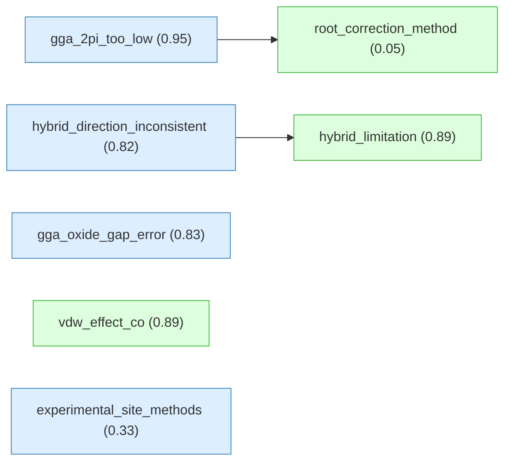
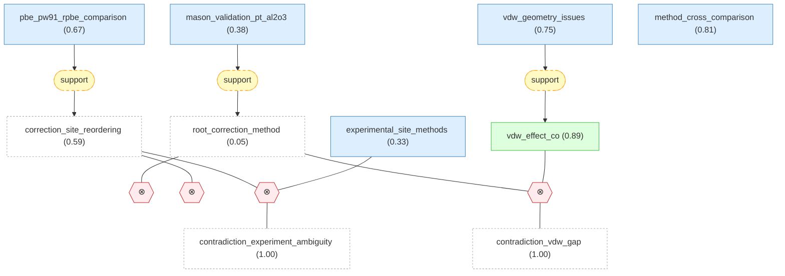
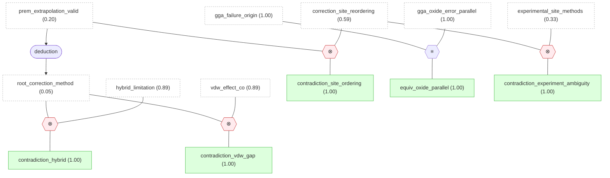

# surface-catalysis-gaia

## Overview

## Introduction

#### root_correction_method ★

📌 `root_correction_method`   |   Belief: **0.05**

> The DFT-GGA chemisorption energy for CO on a metal surface at a given adsorption site and substrate can be corrected to a first-principles benchmark using a linear extrapolation based on the gas-phase CO singlet-triplet excitation energy [@mason2003]: E_chem^corr = E_chem^GGA + (DeltaE_ST^CI - DeltaE_ST^GGA) * m, where DeltaE_ST^CI = 6.095 eV is the CC/CI benchmark singlet-triplet splitting, DeltaE_ST^GGA is the DFT-GGA value computed with the same pseudopotential set used for the surface calculation, and m = dE_chem^GGA / dDeltaE_ST^GGA is the slope of the DFT-GGA linear fit determined for that specific adsorption site and metal surface.

🔗 **support**([mason_validation_pt_al2o3](#mason_validation_pt_al2o3))

Reasoning

The successful application of the Mason extrapolation correction to a supported-metal catalyst model (Pt/alpha-Al2O3), reducing the systematic DFT error to ~0.02 eV, demonstrates that the method works beyond the ideal single-crystal surfaces used for its original parameterization, strengthening the case for its practical utility in more realistic catalyst models.

#### gga_2pi_too_low ★

📌 `gga_2pi_too_low`   |   Prior: 0.88   |   Belief: **0.95**

> The GGA self-interaction error in plane-wave DFT calculations on transition-metal surfaces places the unoccupied CO 2pi* orbital too low in energy with respect to the substrate Fermi level, and this orbital energy misplacement is the principal electronic-structure origin of the GGA error in CO chemisorption energies.

#### hybrid_direction_inconsistent ★

📌 `hybrid_direction_inconsistent`   |   Prior: 0.78   |   Belief: **0.82**

> Hybrid functionals (PBE0, HSE03) shift the CO adsorption energy toward weaker binding on Pt(111) but toward stronger binding on Cu(111), revealing that the direction of the hybrid correction relative to GGA is not consistent across different transition metals.

#### hybrid_limitation ★

📌 `hybrid_limitation`   |   Prior: 0.80   |   Belief: **0.89**

> The inclusion of a fraction of exact nonlocal exchange via the PBE0 and HSE03 hybrid functionals in plane-wave periodic-slab DFT calculations does not produce a uniform improvement in agreement with experimental CO adsorption energies across different transition-metal substrates: for Cu(111) the hybrid functionals give adsorption energies that differ from the GGA result by only ~0.2 eV (on-top vs. hollow), whereas for Pt(111) and Ru(0001) the hybrid-GGA differences can reach 0.4 eV and 0.25-0.45 eV respectively, and the direction of the correction is not consistent across metals — hybrid functionals shift the CO/Pt(111) adsorption energy toward weaker binding but shift CO/Cu(111) toward stronger binding.

🔗 **support**([hybrid_magnitude_nonuniform](#hybrid_magnitude_nonuniform), [hybrid_direction_inconsistent](#hybrid_direction_inconsistent))

Reasoning

The compound claim hybrid_limitation asserts that hybrid functionals do NOT produce uniform improvement, which manifests in two distinct ways: the magnitude of the correction varies across metals (captured by hybrid_magnitude_nonuniform) AND the direction of the correction is inconsistent — stronger binding on Cu but weaker on Pt (captured by hybrid_direction_inconsistent). Both aspects are required to fully capture the non-uniformity.

#### gga_oxide_gap_error ★

📌 `gga_oxide_gap_error`   |   Prior: 0.75   |   Belief: **0.83**

> A second, independent systematic contribution to errors in GGA-calculated oxidation energies for 3d transition metal oxides arises from the GGA underestimation of the HOMO-LUMO gap in the oxide itself — this error is distinct from the molecular-reference (O2) error and reflects GGA's fundamental band-gap problem in strongly correlated oxide materials.

#### vdw_effect_co ★

📌 `vdw_effect_co`   |   Prior: 0.82   |   Belief: **0.89**

> For CO adsorption on metal surfaces at 0.1 ML coverage, dispersion-inclusive exchange-correlation treatments predict significantly larger adsorption energies than semi-local GGA: vdW-DF predicts 363 meV versus PBE (dispersion-free) at 247 meV for the C-bound adsorption geometry — a difference of ~116 meV from van der Waals interactions alone, which is comparable in magnitude to the GGA singlet-triplet correction and represents a separate, additive source of DFT error not addressed by the Mason extrapolation method.

🔗 **support**([vdw_geometry_issues](#vdw_geometry_issues))

Reasoning

vdw_geometry_issues documents that vdW-inclusive functionals can alter adsorption geometries compared to both GGA and experiment, which strengthens vdw_effect_co: the vdW contribution is not merely a uniform energy shift but affects the potential-energy surface shape, meaning it cannot be trivially added to the Mason-corrected GGA energy as a simple post-hoc correction.

#### experimental_site_methods ★

📌 `experimental_site_methods`   |   Prior: 0.78   |   Belief: **0.33**

> Reflection-absorption infrared spectroscopy (RAIRS) and sum-frequency generation (SFG) spectroscopy give qualitatively different coverage dependences for the C-O stretch of CO adsorbed in atop sites on transition-metal surfaces, meaning that experimental determination of the most stable CO adsorption site — the quantity that DFT site-preference predictions aim to reproduce — depends on the spectroscopic method used and on the coverage regime probed.

## Surface Catalysis DFT-GGA Chemisorption Energy Correction (Mason et al., 2003).

#### prem_linear_mapping

📌 `prem_linear_mapping`   |   Prior: 0.80   |   Belief: **0.98**

> For CO chemisorption on a metal surface at a given adsorption site and substrate, the DFT-GGA chemisorption energy E_chem^GGA and the DFT-GGA gas-phase CO singlet-triplet splitting DeltaE_ST^GGA obey a linear relation E_chem^GGA = E_0 + m * DeltaE_ST^GGA over the sampled interval DeltaE_ST^GGA in [5.35, 5.84] eV, and the electronic-structure discrepancy between DFT-GGA and high-level wavefunction theory (CC/CI) that manifests in the gas-phase DeltaE_ST maps linearly onto the bonding descriptors that control surface chemisorption for the adsorption geometry considered.

🔗 **support**([method_cross_comparison](#method_cross_comparison))

Reasoning

The testing of the (DeltaE_ST, E_CO^a) linear correlation across a much wider range of DeltaE_ST values using diverse methods (PBE, HSE06, PBE0, HF, CR-CC(2,3)) provides a more stringent test of the linear-mapping hypothesis than the original Mason study alone, and the persistence of the linear relation across this multi-method dataset supports the generality of the underlying physical mechanism.

#### prem_benchmark_valid

📌 `prem_benchmark_valid`   |   Prior: 0.75   |   Belief: **0.68**

> The gas-phase CO singlet-triplet excitation energy benchmark value DeltaE_ST^CI = 6.095 eV, obtained from coupled-cluster and large configuration-interaction (CC/CI) calculations that reproduce the experimental value, is the appropriate target for correcting DFT-GGA surface chemisorption energies — that is, metal-induced polarization, image-charge stabilization, substrate screening, and chemical shifts of molecular excitation energies in the chemisorbed geometry do not substantially change the reference singlet-triplet energy needed for the linear correction along the DFT-GGA mapping.

#### prem_extrapolation_valid

📌 `prem_extrapolation_valid`   |   Prior: 0.70   |   Belief: **0.20**

> The empirical linear relation E_chem^GGA = E_0 + m * DeltaE_ST^GGA obtained from DFT-GGA pseudopotential sampling over the interval DeltaE_ST^GGA in [5.35, 5.84] eV remains valid when the independent variable is shifted to the CC/CI benchmark value DeltaE_ST^CI = 6.095 eV — i.e., no significant nonlinearity or change in slope m occurs between the sampled DFT-GGA points and the CI target.

#### root_correction_method ★

📌 `root_correction_method`   |   Belief: **0.05**

> The DFT-GGA chemisorption energy for CO on a metal surface at a given adsorption site and substrate can be corrected to a first-principles benchmark using a linear extrapolation based on the gas-phase CO singlet-triplet excitation energy [@mason2003]: E_chem^corr = E_chem^GGA + (DeltaE_ST^CI - DeltaE_ST^GGA) * m, where DeltaE_ST^CI = 6.095 eV is the CC/CI benchmark singlet-triplet splitting, DeltaE_ST^GGA is the DFT-GGA value computed with the same pseudopotential set used for the surface calculation, and m = dE_chem^GGA / dDeltaE_ST^GGA is the slope of the DFT-GGA linear fit determined for that specific adsorption site and metal surface.

🔗 **support**([mason_validation_pt_al2o3](#mason_validation_pt_al2o3))

Reasoning

The successful application of the Mason extrapolation correction to a supported-metal catalyst model (Pt/alpha-Al2O3), reducing the systematic DFT error to ~0.02 eV, demonstrates that the method works beyond the ideal single-crystal surfaces used for its original parameterization, strengthening the case for its practical utility in more realistic catalyst models.

## Contradiction-search findings for Mason et al. (2003) correction method.

```mermaid
graph TD
    prem_extrapolation_valid["prem_extrapolation_valid (0.20)"]:::external
    root_correction_method["root_correction_method (0.05)"]:::external
    gga_2pi_too_low["gga_2pi_too_low (0.95)"]:::premise
    gga_back_donation_overestimated["gga_back_donation_overestimated (0.99)"]:::derived
    gga_failure_origin["gga_failure_origin (1.00)"]:::derived
    co_2pi_mechanism["co_2pi_mechanism (0.89)"]:::premise
    correction_site_reordering["correction_site_reordering (0.59)"]:::derived
    hybrid_magnitude_nonuniform["hybrid_magnitude_nonuniform (0.85)"]:::premise
    hybrid_direction_inconsistent["hybrid_direction_inconsistent (0.82)"]:::premise
    hybrid_limitation["hybrid_limitation (0.89)"]:::derived
    correction_reduces_site_spread["correction_reduces_site_spread (0.44)"]:::premise
    gga_o2_sie_error["gga_o2_sie_error (0.87)"]:::premise
    gga_oxide_gap_error["gga_oxide_gap_error (0.83)"]:::premise
    gga_oxide_error_parallel["gga_oxide_error_parallel (1.00)"]:::derived
    pbe_pw91_rpbe_comparison["pbe_pw91_rpbe_comparison (0.67)"]:::external
    experimental_site_methods["experimental_site_methods (0.33)"]:::external
    contradiction_hybrid["contradiction_hybrid (1.00)"]:::external
    contradiction_site_ordering["contradiction_site_ordering (1.00)"]:::external
    equiv_oxide_parallel["equiv_oxide_parallel (1.00)"]:::external
    contradiction_experiment_ambiguity["contradiction_experiment_ambiguity (1.00)"]:::external
    strat_0(["deduction"])
    prem_extrapolation_valid --> strat_0
    strat_0 --> root_correction_method
    strat_1(["support"]):::weak
    gga_2pi_too_low --> strat_1
    strat_1 --> gga_back_donation_overestimated
    strat_2(["support"]):::weak
    gga_2pi_too_low --> strat_2
    gga_back_donation_overestimated --> strat_2
    strat_2 --> gga_failure_origin
    strat_3(["support"]):::weak
    hybrid_magnitude_nonuniform --> strat_3
    hybrid_direction_inconsistent --> strat_3
    strat_3 --> hybrid_limitation
    strat_4(["support"]):::weak
    gga_o2_sie_error --> strat_4
    gga_oxide_gap_error --> strat_4
    strat_4 --> gga_oxide_error_parallel
    strat_6(["support"]):::weak
    correction_reduces_site_spread --> strat_6
    strat_6 --> root_correction_method
    strat_9(["support"]):::weak
    pbe_pw91_rpbe_comparison --> strat_9
    strat_9 --> correction_site_reordering
    oper_0{{"⊗"}}:::contra
    root_correction_method --- oper_0
    hybrid_limitation --- oper_0
    oper_0 --- contradiction_hybrid
    oper_1{{"⊗"}}:::contra
    prem_extrapolation_valid --- oper_1
    correction_site_reordering --- oper_1
    oper_1 --- contradiction_site_ordering
    oper_2{{"≡"}}
    gga_failure_origin --- oper_2
    gga_oxide_error_parallel --- oper_2
    oper_2 --- equiv_oxide_parallel
    oper_3{{"⊗"}}:::contra
    root_correction_method --- oper_3
    oper_4{{"⊗"}}:::contra
    correction_site_reordering --- oper_4
    experimental_site_methods --- oper_4
    oper_4 --- contradiction_experiment_ambiguity

    classDef setting fill:#f0f0f0,stroke:#999,color:#333
    classDef premise fill:#ddeeff,stroke:#4488bb,color:#333
    classDef derived fill:#ddffdd,stroke:#44bb44,color:#333
    classDef question fill:#fff3dd,stroke:#cc9944,color:#333
    classDef background fill:#f5f5f5,stroke:#bbb,stroke-dasharray: 5 5,color:#333
    classDef orphan fill:#fff,stroke:#ccc,stroke-dasharray: 5 5,color:#333
    classDef external fill:#fff,stroke:#aaa,stroke-dasharray: 3 3,color:#333
    classDef weak fill:#fff9c4,stroke:#f9a825,stroke-dasharray: 5 5,color:#333
    classDef contra fill:#ffebee,stroke:#c62828,color:#333
```

#### gga_2pi_too_low ★

📌 `gga_2pi_too_low`   |   Prior: 0.88   |   Belief: **0.95**

> The GGA self-interaction error in plane-wave DFT calculations on transition-metal surfaces places the unoccupied CO 2pi* orbital too low in energy with respect to the substrate Fermi level, and this orbital energy misplacement is the principal electronic-structure origin of the GGA error in CO chemisorption energies.

#### gga_back_donation_overestimated

📌 `gga_back_donation_overestimated`   |   Prior: 0.82   |   Belief: **0.99**

> Because the GGA places the CO 2pi* orbital too low in energy relative to the substrate Fermi level, it causes spuriously strong back-donation of electrons from the metal d states into the unoccupied CO 2pi* orbital, which overestimates the chemisorption strength at adsorption sites where back-donation dominates the metal-CO bonding.

🔗 **support**([gga_2pi_too_low](#gga_2pi_too_low))

Reasoning

If GGA places the CO 2pi* orbital too low, then — by the established Blyholder model of CO chemisorption — metal d electrons can back-donate into the artificially stabilized 2pi* acceptor orbital, causing the back-donation contribution to the chemisorption bond to be overestimated.

#### gga_failure_origin

📌 `gga_failure_origin`   |   Prior: 0.85   |   Belief: **1.00**

> The principal reason that GGA exchange-correlation functionals in plane-wave DFT produce incorrect adsorption-site energy differences for CO on transition-metal surfaces (including Ru(0001)) is that GGA inadequately predicts the relative energy of the unoccupied CO 2pi* orbital with respect to the substrate Fermi level — the GGA self-interaction error places the CO 2pi* orbital too low in energy, causing spuriously strong back-donation from the metal d states into 2pi* and therefore overestimating the chemisorption strength at sites where back-donation dominates.

🔗 **support**([gga_2pi_too_low](#gga_2pi_too_low), [gga_back_donation_overestimated](#gga_back_donation_overestimated))

Reasoning

The compound claim gga_failure_origin states that GGA places CO 2pi* too low (captured by gga_2pi_too_low) AND that this causes spuriously strong back-donation overestimating chemisorption strength (captured by gga_back_donation_overestimated). The two atomic claims together capture the full causal chain asserted by the compound claim.

#### co_2pi_mechanism

📌 `co_2pi_mechanism`   |   Prior: 0.82   |   Belief: **0.89**

> For CO chemisorption on late transition-metal surfaces, the gas-phase CO singlet-triplet excitation energy DeltaE_ST (5sigma → 2pi* excitation, experimentally benchmarked at 6.095 eV) is closely related to the energetic position of the CO 2pi* orbital relative to the substrate Fermi level — the GGA functional underestimates DeltaE_ST because it places the 2pi* orbital too low, and this gas-phase error correlates with the GGA overbinding error on the surface through the proportionality between DeltaE_ST and 2pi*-Fermi-level alignment.

#### correction_site_reordering

📌 `correction_site_reordering`   |   Prior: 0.78   |   Belief: **0.59**

> Applying the Mason linear-extrapolation correction to DFT-GGA chemisorption energies for CO on Pt(111), Rh(111), Pd(111), Cu(111) and the corresponding (100) surfaces changes the DFT-GGA predicted energetic ordering of high-symmetry adsorption sites — that is, the correction is site-specific and can alter which adsorption site is predicted to be most stable on a given metal surface.

🔗 **support**([pbe_pw91_rpbe_comparison](#pbe_pw91_rpbe_comparison))

Reasoning

The systematic difference between RPBE and PW91/PBE chemisorption energies (~0.2-0.3 eV) shows that the adsorption energy depends sensitively on the choice of GGA functional. Since the Mason correction slope m is derived from a specific GGA functional's linear fit, the correction is functional-dependent, and the magnitude of the correction — and hence the site reordering effect — will vary with the functional used.

#### hybrid_magnitude_nonuniform

📌 `hybrid_magnitude_nonuniform`   |   Prior: 0.82   |   Belief: **0.85**

> The magnitude of the shift in CO adsorption energy caused by switching from GGA to hybrid functionals (PBE0, HSE03) varies significantly across transition-metal substrates: for Cu(111) the shift is only ~0.2 eV, for Pt(111) it reaches up to ~0.4 eV, and for Ru(0001) it is ~0.25-0.45 eV — meaning the hybrid correction is not a uniform shift across metals.

#### hybrid_direction_inconsistent ★

📌 `hybrid_direction_inconsistent`   |   Prior: 0.78   |   Belief: **0.82**

> Hybrid functionals (PBE0, HSE03) shift the CO adsorption energy toward weaker binding on Pt(111) but toward stronger binding on Cu(111), revealing that the direction of the hybrid correction relative to GGA is not consistent across different transition metals.

#### hybrid_limitation ★

📌 `hybrid_limitation`   |   Prior: 0.80   |   Belief: **0.89**

> The inclusion of a fraction of exact nonlocal exchange via the PBE0 and HSE03 hybrid functionals in plane-wave periodic-slab DFT calculations does not produce a uniform improvement in agreement with experimental CO adsorption energies across different transition-metal substrates: for Cu(111) the hybrid functionals give adsorption energies that differ from the GGA result by only ~0.2 eV (on-top vs. hollow), whereas for Pt(111) and Ru(0001) the hybrid-GGA differences can reach 0.4 eV and 0.25-0.45 eV respectively, and the direction of the correction is not consistent across metals — hybrid functionals shift the CO/Pt(111) adsorption energy toward weaker binding but shift CO/Cu(111) toward stronger binding.

🔗 **support**([hybrid_magnitude_nonuniform](#hybrid_magnitude_nonuniform), [hybrid_direction_inconsistent](#hybrid_direction_inconsistent))

Reasoning

The compound claim hybrid_limitation asserts that hybrid functionals do NOT produce uniform improvement, which manifests in two distinct ways: the magnitude of the correction varies across metals (captured by hybrid_magnitude_nonuniform) AND the direction of the correction is inconsistent — stronger binding on Cu but weaker on Pt (captured by hybrid_direction_inconsistent). Both aspects are required to fully capture the non-uniformity.

#### correction_reduces_site_spread

📌 `correction_reduces_site_spread`   |   Prior: 0.65   |   Belief: **0.44**

> Applying the post-DFT singlet-triplet extrapolation correction to the set of high-symmetry adsorption-site chemisorption energies for CO on a given metal surface reduces the computed energetic spread (range) of chemisorption energies across sites, systematically narrowing the site-energy distribution compared to uncorrected GGA.

#### gga_o2_sie_error

📌 `gga_o2_sie_error`   |   Prior: 0.80   |   Belief: **0.87**

> A systematic contribution to errors in GGA-calculated oxidation energies for 3d transition metal oxides arises from the GGA self-interaction error in the O2 molecule binding energy — this is the same physical mechanism (GGA frontier-orbital error in a diatomic molecule) that produces the CO chemisorption energy error on metal surfaces, establishing that the problem is general to diatomic adsorbates.

#### gga_oxide_gap_error ★

📌 `gga_oxide_gap_error`   |   Prior: 0.75   |   Belief: **0.83**

> A second, independent systematic contribution to errors in GGA-calculated oxidation energies for 3d transition metal oxides arises from the GGA underestimation of the HOMO-LUMO gap in the oxide itself — this error is distinct from the molecular-reference (O2) error and reflects GGA's fundamental band-gap problem in strongly correlated oxide materials.

#### gga_oxide_error_parallel

📌 `gga_oxide_error_parallel`   |   Prior: 0.80   |   Belief: **1.00**

> Two separate and systematic contributions to errors in GGA density-functional calculated oxidation energies for 3d transition metal oxides are identified: (a) an error from the GGA self-interaction error in the O2 molecule binding energy (analogous to the CO singlet-triplet error), and (b) an error from the GGA underestimation of the HOMO-LUMO gap in the oxide — establishing that the GGA molecular reference error problem extends beyond CO to other diatomic adsorbates and their surface reactions.

🔗 **support**([gga_o2_sie_error](#gga_o2_sie_error), [gga_oxide_gap_error](#gga_oxide_gap_error))

Reasoning

The compound claim gga_oxide_error_parallel enumerates two separate and systematic error sources: the GGA O2 self-interaction error (captured by gga_o2_sie_error) and the GGA oxide HOMO-LUMO gap underestimation (captured by gga_oxide_gap_error). The two atomic claims are independent and each identifies a distinct physical mechanism for GGA errors in oxide energetics.

## Upstream support findings — functional comparison, vdW, experimental site determination.

#### pbe_pw91_rpbe_comparison

📌 `pbe_pw91_rpbe_comparison`   |   Prior: 0.75   |   Belief: **0.67**

> Comparisons among exchange-correlation functionals for CO chemisorption on transition-metal surfaces show that PBE GGA yields chemisorption energies and energy barriers very close to PW91 GGA (the functional used in the original Mason extrapolation method), while the revised PBE (RPBE) functional systematically gives weaker (less negative, ~0.2-0.3 eV smaller in magnitude) chemisorption energies than both PBE and PW91.

#### vdw_effect_co ★

📌 `vdw_effect_co`   |   Prior: 0.82   |   Belief: **0.89**

> For CO adsorption on metal surfaces at 0.1 ML coverage, dispersion-inclusive exchange-correlation treatments predict significantly larger adsorption energies than semi-local GGA: vdW-DF predicts 363 meV versus PBE (dispersion-free) at 247 meV for the C-bound adsorption geometry — a difference of ~116 meV from van der Waals interactions alone, which is comparable in magnitude to the GGA singlet-triplet correction and represents a separate, additive source of DFT error not addressed by the Mason extrapolation method.

🔗 **support**([vdw_geometry_issues](#vdw_geometry_issues))

Reasoning

vdw_geometry_issues documents that vdW-inclusive functionals can alter adsorption geometries compared to both GGA and experiment, which strengthens vdw_effect_co: the vdW contribution is not merely a uniform energy shift but affects the potential-energy surface shape, meaning it cannot be trivially added to the Mason-corrected GGA energy as a simple post-hoc correction.

#### vdw_geometry_issues

📌 `vdw_geometry_issues`   |   Prior: 0.70   |   Belief: **0.75**

> The nonlocal van der Waals density functional variant optB86b-vdW predicts larger CO adsorption energies than semi-local GGA but can yield adsorption geometries that differ markedly from experiment and from GGA-predicted geometries, indicating that vdW-inclusive functionals do not simply add a uniform attractive correction but can alter the potential-energy surface and site preferences in ways that are not yet fully understood.

#### mason_validation_pt_al2o3

📌 `mason_validation_pt_al2o3`   |   Prior: 0.65   |   Belief: **0.38**

> Applying the Mason et al. extrapolation correction for known DFT errors in CO chemisorption energies to Pt/alpha-Al2O3 slab calculations reduces the systematic DFT error to an estimated uncertainty of approximately 0.02 eV, demonstrating that the correction method is effective for supported-metal catalyst models beyond the single-crystal surfaces on which it was originally parameterized.

#### method_cross_comparison

📌 `method_cross_comparison`   |   Prior: 0.72   |   Belief: **0.81**

> Across a set of electronic-structure calculations yielding pairs (DeltaE_T-S, E_CO^a) for CO on Pd model systems computed with diverse methods spanning plane-wave slab PBE, plane-wave slab HSE06, plane-wave cluster PBE, plane-wave cluster HSE06, localized-basis HF, PBE, PBE0, and CR-CC(2,3) on finite Pd clusters, the linear correlation between the gas-phase CO singlet-triplet splitting and the chemisorption energy is tested across a much wider range of DeltaE_ST values than in the original Mason study, providing a multi-method validation of the fundamental linear-mapping hypothesis.

#### experimental_site_methods ★

📌 `experimental_site_methods`   |   Prior: 0.78   |   Belief: **0.33**

> Reflection-absorption infrared spectroscopy (RAIRS) and sum-frequency generation (SFG) spectroscopy give qualitatively different coverage dependences for the C-O stretch of CO adsorbed in atop sites on transition-metal surfaces, meaning that experimental determination of the most stable CO adsorption site — the quantity that DFT site-preference predictions aim to reproduce — depends on the spectroscopic method used and on the coverage regime probed.

## Cross-paper operators for surface-catalysis-gaia.

#### contradiction_hybrid

📌 `contradiction_hybrid`   |   Prior: 0.88   |   Belief: **1.00**

> not_both_true(A, B)

#### contradiction_site_ordering

📌 `contradiction_site_ordering`   |   Prior: 0.82   |   Belief: **1.00**

> not_both_true(A, B)

#### equiv_oxide_parallel

📌 `equiv_oxide_parallel`   |   Prior: 0.70   |   Belief: **1.00**

> same_truth(A, B)

#### contradiction_vdw_gap

📌 `contradiction_vdw_gap`   |   Prior: 0.90   |   Belief: **1.00**

> not_both_true(A, B)

#### contradiction_experiment_ambiguity

📌 `contradiction_experiment_ambiguity`   |   Prior: 0.75   |   Belief: **1.00**

> not_both_true(A, B)

## Inference Results

**BP converged:** True (2 iterations)

| Label | Type | Prior | Belief | Role |
|-------|------|-------|--------|------|
| [root_correction_method](#root_correction_method) | claim | — | 0.0480 | derived |
| [prem_extrapolation_valid](#prem_extrapolation_valid) | claim | 0.70 | 0.2024 | independent |
| [experimental_site_methods](#experimental_site_methods) | claim | 0.78 | 0.3250 | independent |
| [mason_validation_pt_al2o3](#mason_validation_pt_al2o3) | claim | 0.65 | 0.3781 | independent |
| [correction_reduces_site_spread](#correction_reduces_site_spread) | claim | 0.65 | 0.4424 | independent |
| [correction_site_reordering](#correction_site_reordering) | claim | 0.78 | 0.5886 | derived |
| [pbe_pw91_rpbe_comparison](#pbe_pw91_rpbe_comparison) | claim | 0.75 | 0.6713 | independent |
| [prem_benchmark_valid](#prem_benchmark_valid) | claim | 0.75 | 0.6774 | independent |
| [vdw_geometry_issues](#vdw_geometry_issues) | claim | 0.70 | 0.7548 | independent |
| [method_cross_comparison](#method_cross_comparison) | claim | 0.72 | 0.8107 | independent |
| [hybrid_direction_inconsistent](#hybrid_direction_inconsistent) | claim | 0.78 | 0.8193 | independent |
| [gga_oxide_gap_error](#gga_oxide_gap_error) | claim | 0.75 | 0.8337 | independent |
| [hybrid_magnitude_nonuniform](#hybrid_magnitude_nonuniform) | claim | 0.82 | 0.8521 | independent |
| [gga_o2_sie_error](#gga_o2_sie_error) | claim | 0.80 | 0.8670 | independent |
| [co_2pi_mechanism](#co_2pi_mechanism) | claim | 0.82 | 0.8853 | independent |
| [vdw_effect_co](#vdw_effect_co) | claim | 0.82 | 0.8865 | derived |
| [hybrid_limitation](#hybrid_limitation) | claim | 0.80 | 0.8875 | derived |
| [gga_2pi_too_low](#gga_2pi_too_low) | claim | 0.88 | 0.9546 | independent |
| [prem_linear_mapping](#prem_linear_mapping) | claim | 0.80 | 0.9828 | derived |
| [gga_back_donation_overestimated](#gga_back_donation_overestimated) | claim | 0.82 | 0.9857 | derived |
| [contradiction_experiment_ambiguity](#contradiction_experiment_ambiguity) | claim | 0.75 | 0.9979 | structural |
| [gga_oxide_error_parallel](#gga_oxide_error_parallel) | claim | 0.80 | 0.9987 | derived |
| [gga_failure_origin](#gga_failure_origin) | claim | 0.85 | 0.9988 | derived |
| [contradiction_hybrid](#contradiction_hybrid) | claim | 0.88 | 0.9994 | structural |
| [contradiction_vdw_gap](#contradiction_vdw_gap) | claim | 0.90 | 0.9994 | structural |
| [contradiction_site_ordering](#contradiction_site_ordering) | claim | 0.82 | 0.9994 | structural |
| [equiv_oxide_parallel](#equiv_oxide_parallel) | claim | 0.70 | 0.9999 | structural |
